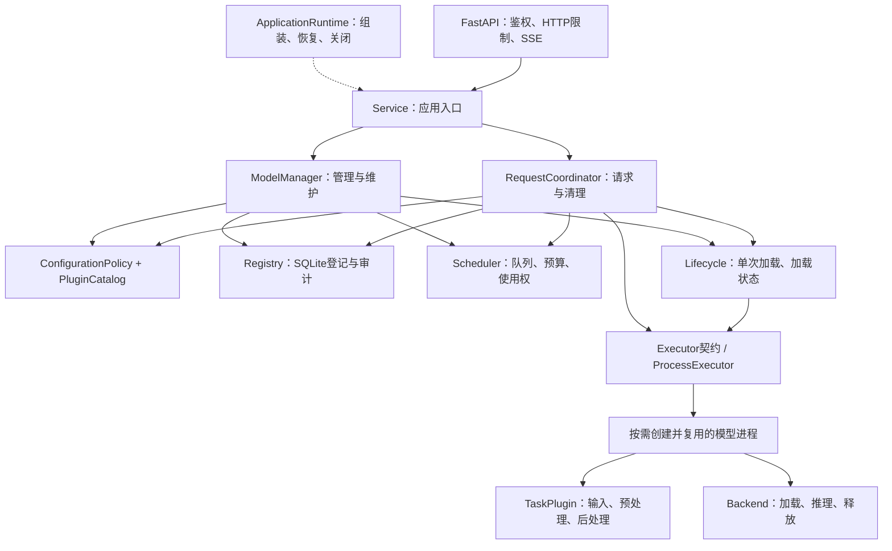

# 模块边界与流程对应

本次沿用用户提供的 START/REG、REQUEST、ADD、REMOVE 流程。业务接口、请求协调、模型登记、资源调度、生命周期和模型执行分别拥有状态，`Service` 只保留兼容入口。SQLite schema 仍为 v1，已有权重和登记可直接使用。

高内聚体现在状态的归属：SQL 留在登记表，预算和排队留在调度器，实例状态留在生命周期，IPC 与停止确认留在执行器，HTTP 收发留在 API。请求协调器不维护另一个预算账本，模型管理器不自己运行推理。

低耦合体现在依赖方向：核心用例不导入 FastAPI、HTTP 客户端、OpenVINO、Torch 或具体插件；通过构造参数传入公开接口。调度器内部集合私有化，只公开原子准入、暂停、排空、快照等方法。`runtime.py` 是选择 SQLite、执行器和插件目录的组装点，不引入依赖注入框架。

可插拔体现在 `contracts.py` 的 `TaskPlugin`、`Backend`、`Executor`、`PluginCatalog`、`StreamingBackend` 和 `StreamingTask`。`BackendFeatures` 声明生命周期是否外部管理、执行能否超出本地进程存活期、是否需要文件、是否为合成替身、是否提供增量输出；主流程根据契约处理，不比较 `http` 或 `mock` 名称。

## 三条主流程

业务：解析名称/版本/默认别名 → 检查启用、能力和输入 → 原子预留驻留预算、请求预算、执行名额和使用权 → 已加载复用，否则单次加载 → worker 预处理、推理、后处理 → 发送普通/SSE 输出 → 确认底层停止且输出结束 → 归还请求额度。驻留预算到执行进程退出才释放。

新增：校验路径和插件 → 持久化为禁用、待验证 → 使用同一调度器与执行路径进行真实验证 → 成功后按请求启用，失败保留原因。重新验证先暂停准入并使旧排队请求失效；验证使用明确的管理许可，不临时开放业务。已验证且禁用的模型可以预热，但业务仍需启用。

卸载/停用/移除：检查已登记引用 → 暂停准入并拒绝旧排队请求 → 等在途使用权归零 → 卸载并确认进程退出 → 更新登记。超时保留暂停/未完成卸载状态，不释放仍占用的资源，不自动强杀。移除保留磁盘文件，HTTP 只关闭本地适配器，远端仍是外部管理。

完整节点、分支和测试名称见 [验证报告](verification.md)。这张图描述模块依赖，不替代用户原流程图的分支语义。

## 如何扩展

网页测试入口位于 `web.py` 和 `static/`：前者只提供三个固定静态资源，后者仅通过同源 HTTP 调用业务接口。`GET /v1/models` 沿 `API → Service.available_models → ModelManager.available_models` 返回经过字段白名单过滤的可用模型目录，不加载权重、不暴露管理配置。网页提交和取消仍使用现有请求协调及执行链路，未新增数据库或调度状态。

1. 兼容现有处理方式的模型只增加 JSON 配置，通过管理 API 验证，无需改主流程或重启。
2. 新预处理/后处理新增任务类并在 `tasks/__init__.py` 登记；实现 `validate / prepare / finish`。真实增量输出额外实现 `finish_chunk`。
3. 新运行时新增后端，在 `backends/__init__.py` 通过 `register_backend` 登记工厂、配置校验器、任务输入输出协议族和 `BackendFeatures`。需要流式时实现 `stream`；它的关闭必须等底层生成停止。
4. 新代码插件随受信任应用发布，重启后生效。管理 JSON 不能指定任意 Python 模块；不实现动态远程代码执行或热更新。

后端返回 `execution_unknown` 意味着不能证明执行停止，必须保留隔离额度，不能按普通失败释放。同步完成、取消、异常、累积输出限制和并发限制都是接口契约的一部分。任务可兼容哪些后端由插件登记层约束；配置名称相似不等于模型格式兼容。

`tests/test_architecture_runtime.py` 用不同名称的受控插件和执行器替换实现，验证业务流程、外部状态、持久化隔离、人工确认和指标仍成立；另有静态依赖检查。它验证可替换机制，不代表该受控插件是一个真实模型供应商。
